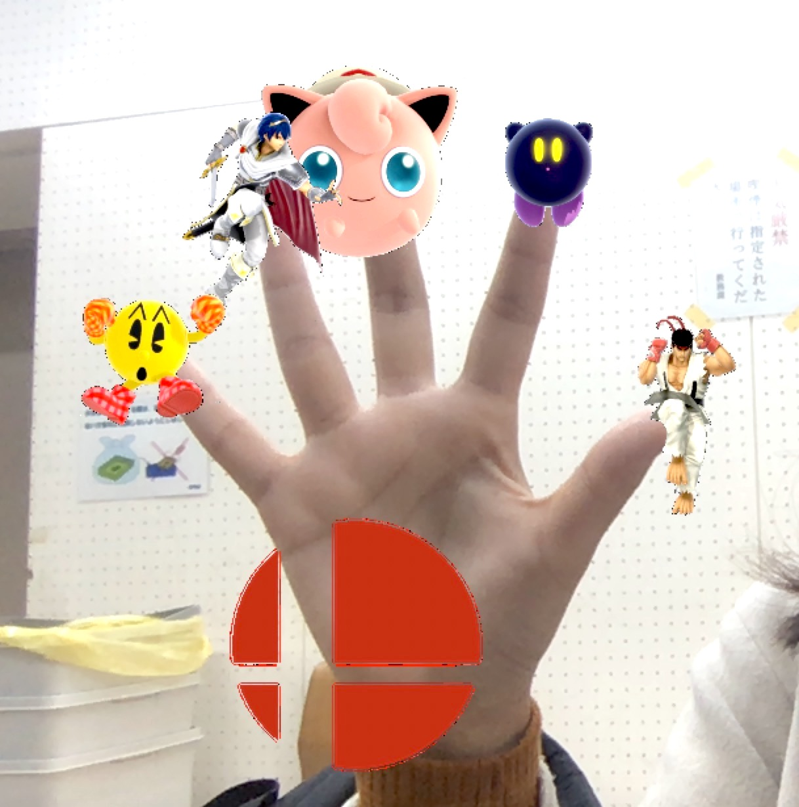

# SH_sims
A demo for OPENCV practice in 2018
## Functions
* a character selector for smash BROS

## Intro
* In the game SMASH BROS, sometimes it is hard for the users to choose which characters to use, that's why I design this selector.
* At the begining of the code, you can add your favourote characters into the selection list(15 characters now)
* Run the code, open your hand and it will start to shuffle the characters(when the game logo shows in your hand)

* Show only one finger and it will decide the character for you

## Methodology
In this part I will introduce the method I use
### remove the background
To remove the static background, I remove the background firstly.
* Take a template when press the keyboard
* Use current frame substract template

### Skin threshold
Use the skin threshod to isolate the hand part
* Use HSV color threshold to get the mask

### Count the number of fingers
Use the convex hull to dectect the fingers
* Find the convex hull
* Use hierarchy to get far points and start points
* Judge whether it is a finger
(This part consider the [handy by PierfrancescoSoffritti](https://github.com/PierfrancescoSoffritti/handy)

### Add pictures on the fingers
* Screenshot characters in the game and convert to png
* If fingers == 5, random the pngs, if fingers == 1, decide the character and show it on the finger
* Show images on the fingers

## Limitations
* At first I want to do a simple openCV demo with hand detection, and after doing part of the job I find it is difficult to do a perfect work with poeple's face, hands and background, that's why finally it is only for hand detection
* It can only work when the background is clean and with few noise
* There are only 15 characters in this demo now, can add more in the future.